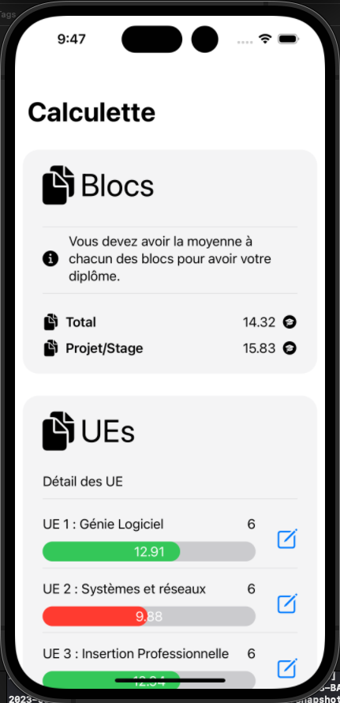
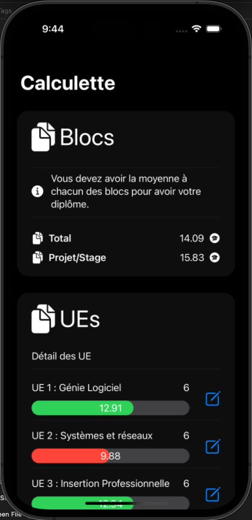
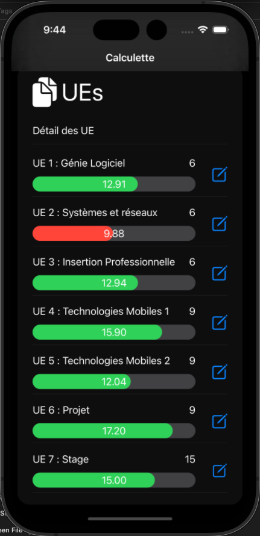
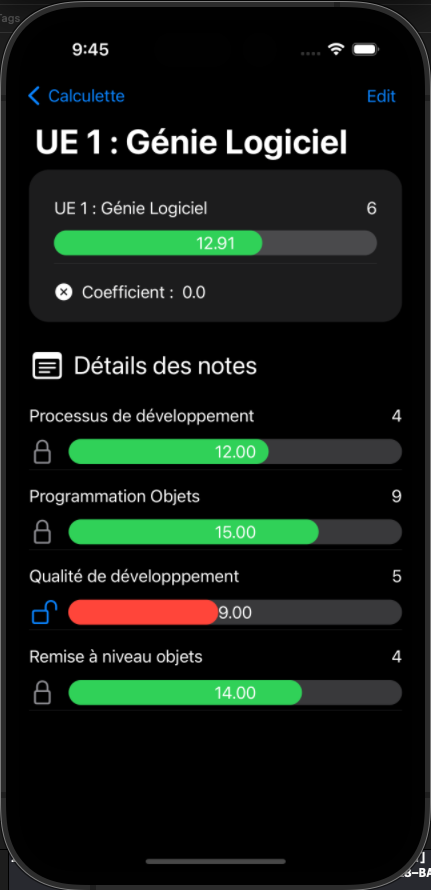
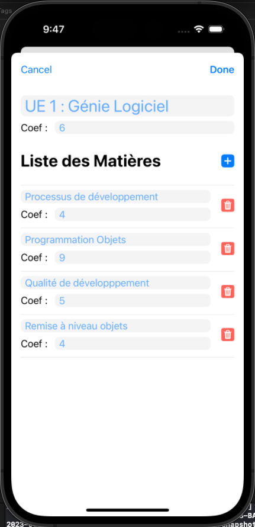
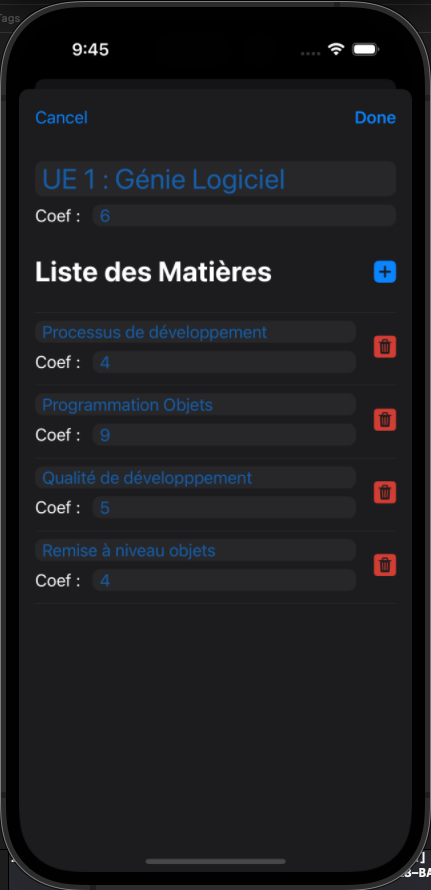

# IOS-Notes

## Principe

Cette Application IOS réalisée avec Swift et Swift UI est un calculateur de notes calqué sur le systemede notation de ma licence. 

Le but était de réaliser un modele MVVM avec des pages qui interdépendent les unes des autres (calcul des moyennes) et d'y implementer une persistance afin de verifier que chaque information est bel et bien retransmise au model.

Les notes de chaque matière peuvent être modifiée par un drag du custom slider une fois le cadenas déverouillé.
##  Visuels

-|-|-
|:-----:|:-----:|:-----:|
Affichange des blocs d'enseignements qui regroupent chacun des Unités d'enseignemen. L'affichage est réalisé dans les deux thèmes.|||
Les Ues ont leurs moyennes colorées en fonction de la moyenne et l'on peut naviguer vers le détail de leurs notes qui deviennent modifibales en drag en drop si l'on deverouille le cadenas|||
Le bouton edit ouvre cette page modale d'édition de l'Ue et d'ajout/suppression des matières|||